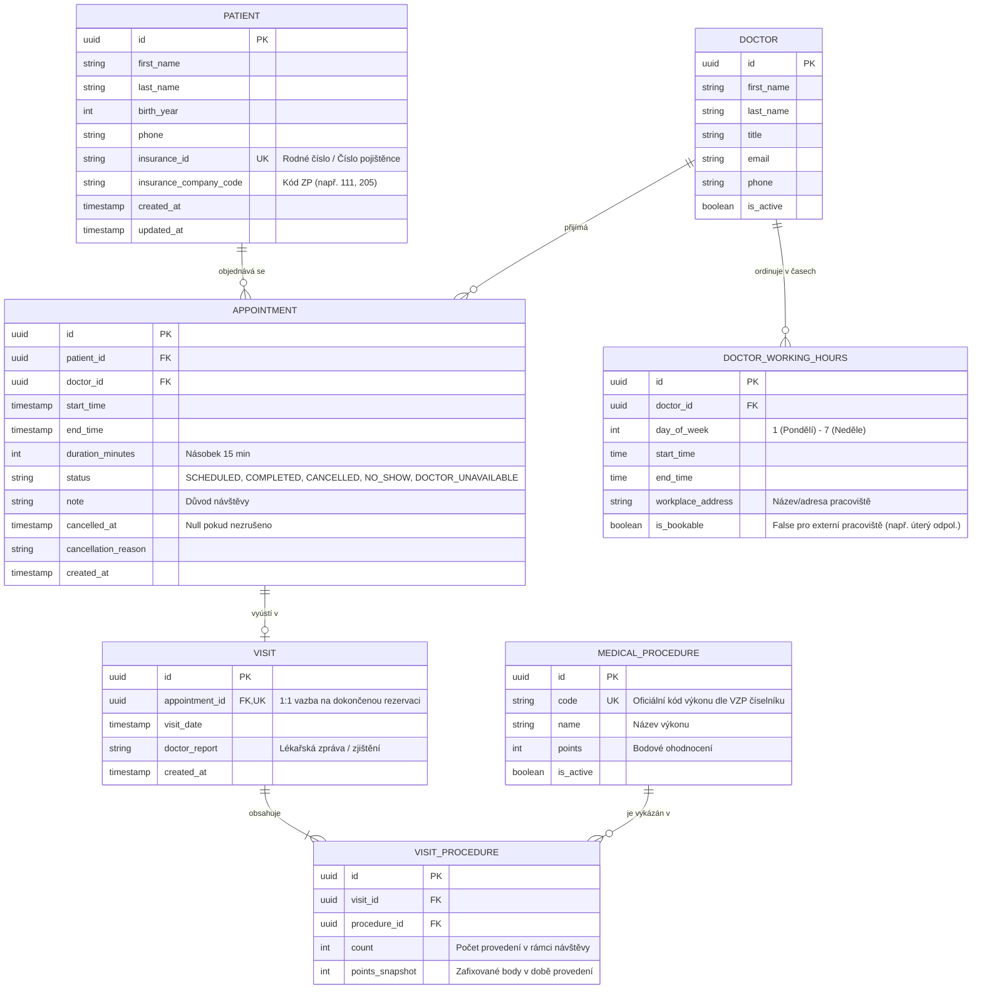

# Ordinace Na Vyhlídce – Rezervační a ambulantní systém

> **Technická dokumentace a zadání projektu (Single Source of Truth)**  
> **Předmět:** Pokročilé programování (PPRO), ZS 2026/2027, FIM UHK  
> **Vyučující / Konzultace:** Dominik Palla (`dominik.palla@uhk.cz`)  
> **Zvolené téma:** **Zadání A: Rezervace v ordinaci**  
> **Status:** Inicializace projektu, specifikace požadavků, architektonický návrh a rozhodnutí.

---

## 1. O projektu a kontext klienta

### 1.1 Klient a ordinace
- **Klient:** MUDr. Jana Hrubá, Ordinace Na Vyhlídce.
- **Charakteristika praxe:** Soukromá lékařská praxe zahrnující 3 lékaře na částečné úvazky a recepční paní Věru.
- **Klientská základna:** Přibližně 900 registrovaných pacientů, z nichž zhruba polovina dochází na pravidelné kontroly.

### 1.2 Současný stav („Jak to mají dnes“)
- Veškerá agenda je vedena v papírovém diáři na recepci obyčejnou tužkou.
- Paní Věra při telefonátu pacienta hledá volný termín zdlouhavým listováním v diáři.
- V případě onemocnění lékaře musí recepční ručně vyhledávat pacienty a jednotlivě je obvolávat.
- Na konci každého měsíce paní Věra ručně přepisuje vykázané zdravotní výkony do tabulky pro pojišťovnu, což jí zabírá celý jeden podvečer.
- Za poslední rok došlo minimálně dvakrát ke kolizi, kdy byli na stejný čas objednáni dva pacienti k jednomu lékaři („To se nesmí stávat, to je ostuda“).

---

## 2. Kompletní specifikace požadavků klienta

### 2.1 Co klient chce (Funkční požadavky)
1. **Pacienti v evidenci:**
   - Evidované atributy: Jméno, příjmení, rok narození, telefonní číslo, identifikátor pojištěnce (rodné číslo / číslo pojištěnce), zdravotní pojišťovna (kód pojišťovny).
   - Rychlé fulltextové vyhledávání podle příjmení nebo telefonního čísla (pacient do telefonu sdělí obvykle obojí).
2. **Lékaři a jejich ordinační hodiny:**
   - Každý lékař má specifické ordinační dny a časová okna.
   - Podpora více pracovišť/adres: Jeden z lékařů ordinuje v úterý odpoledne na jiné adrese a na tuto dobu se v tomto systému **nesmí dát objednávat**.
3. **Rezervace na konkrétní termín u konkrétního lékaře:**
   - Rezervaci zadává recepce (paní Věra).
   - Součástí rezervace je strukturovaná poznámka s důvodem návštěvy (např. preventivní prohlídka, bolest zubu, kontrola po zákroku).
4. **Záznam o návštěvě (vykázané výkony):**
   - Při příchodu pacienta a uskutečnění návštěvy lékař/recepce zaznamená provedené výkony.
   - Výkony se vybírají ze spravovaného číselníku výkonů (kód výkonu, název výkonu, bodové ohodnocení).
   - V rámci jedné návštěvy může být provedeno více různých i opakujících se výkonů (vazba M:N).
   - U výkonů lze evidovat multiplicitu / počet jednotek (např. 3× aplikace léčiva).
5. **Zrušení rezervace a statistika nespolehlivosti:**
   - Možnost zrušení rezervace na žádost pacienta či z organizačních důvodů.
   - Evidence historie zrušených rezervací a generování statistiky pacientů, kteří ruší termíny opakovaně (např. identifikace nespolehlivých pacientů typu „paní Krátká nepřišla letos pětkrát“).
6. **Přehled volných termínů (Klíčová funkce):**
   - Týdenní kalendářní pohled pro vybraného lékaře s okamžitým zobrazením dostupných volných slotů.
   - Optimalizováno pro okamžité použití během telefonátu pacienta.
7. **Měsíční výkaz pro pojišťovny:**
   - Generování přehledu za zvolený kalendářní měsíc a vybraného lékaře.
   - Souhrnný seznam provedených výkonů, počet jejich aplikací a celkový součet bodů pro pojišťovnu.
   - Úspora dříve manuálně tráveného podvečera paní Věry.

### 2.2 Na čem klient trvá (Nekompromisní obchodní pravidla)
> Tato pravidla musí striktně vynucovat aplikační a databázová vrstva, nikoliv pouze validace v uživatelském rozhraní:

1. **Zákaz kolize rezervací:** Dvě rezervace na stejný termín (časové překrytí) u stejného lékaře nesmí jít založit za žádných okolností (ani omylem, ani ručně).
2. **Respektování ordinačních hodin:** Rezervaci nelze založit mimo platné ordinační hodiny daného lékaře (ani na časy, kdy ordinuje na externí adrese).
3. **Zákaz zápisu výkonů dopředu:** Zdravotní výkon nelze přiřadit k návštěvě či rezervaci, která se ještě neuskutečnila (musí existovat potvrzená, reálně proběhlá návštěva).
4. **Nemazání historie (Audit Trail):** Historie pacienta, jeho návštěv a vykázaných výkonů se fyzicky z databáze nikdy nemaže. V případě soudního či revizního sporu musí být ordinace schopna doložit veškeré úkony.

### 2.3 Co klient prohodil mimochodem (Ergonomie a výhled do budoucna)
- **Extrémní jednoduchost:** Uživatelské rozhraní musí zvládnout paní Věra, která „s počítačem moc nekamarádí“ (žádná zbytečná klikání, přehledné fonty, jasná tlačítka, intuitivní barvy).
- **Rychlost odezvy:** „Když zvoní telefon, nemůžu čekat, až se to načte.“ – vyhledávání a týdenní přehled musí mít subsekundovou odezvu.
- **Responzivita pro tablet:** Návrh UI musí počítat s budoucím zobrazením na tabletu v ordinaci.
- **Samoobslužné objednávání pacientů přes web:** Klient se toho zatím obává, avšak architektura API a doménový model musí umožnit budoucí připojení pacientského portálu bez nutnosti refaktoringu jádra.

---

## 3. Rozhodnutí k otevřeným bodům zadání (ADR)

*V souladu s pravidly zadání obsahuje tento oddíl explicitní rozhodnutí k bodům, které klient nechal otevřené:*

### Bod 1: Jak dlouho trvá jeden termín (Pevná mřížka vs. dynamická délka)
- **Rozhodnutí:** Systém zavádí pevnou základní časovou mřížku o délce **15 minut** (nejmenší atomický slot). Rezervace mohou zabírat násobky tohoto slotu (standardně 15, 30, 45 nebo 60 minut) v závislosti na typu vyšetření / poznámce.
- **Odůvodnění:** Pevná 15minutová mřížka brání neuspořádané fragmentaci ordinační doby (vzniku 7minutových „hluchých“ mezer), usnadňuje vizualizaci v kalendáři pro paní Věru a zároveň poskytuje dostatečnou flexibilitu pro delší výkony.

### Bod 2: Kdo zakládá rezervaci (Recepce vs. internet)
- **Rozhodnutí:** V 1. etapě zakládá veškeré rezervace výhradně recepce (paní Věra / lékař) přes interní zabezpečené rozhraní s příslušnou rolí. Aplikační vrstva je však striktně oddělena formou REST API a servisní vrstvy, což umožní v budoucnu napojit veřejný formulář pro pacienty bez úpravy doménové logiky.
- **Odůvodnění:** Eliminují se obavy MUDr. Hrubé z nekontrolovaného chování pacientů v pilotní fázi a recepce si udrží plnou kontrolu nad diářem, přičemž systém zůstává architektonicky otevřený pro expanzi.

### Bod 3: Co se zrušenou rezervací (Ztráta z diáře vs. statistika nespolehlivosti)
- **Rozhodnutí:** Rezervace implementuje stavový automat (`SCHEDULED`, `COMPLETED`, `CANCELLED`, `NO_SHOW`). Zrušená rezervace přejde do stavu `CANCELLED` a zaznamená se čas zrušení, důvod a kdo zrušení inicioval; v kalendářním zobrazení diáře se její časový slot vizuálně ihned uvolní pro nového pacienta, ale v databázi záznam zůstává zachován pro analytické přehledy a statistiku často rušících pacientů.
- **Odůvodnění:** Je plně vyřešen zdánlivý rozpor v požadavcích klienta – kalendář má recepční čistý a volný k obsazení, zatímco vedení má k dispozici přesný přehled o pacientech se špatnou platební morálkou či častými absencemi.

### Bod 4: Jednoznačná totožnost pacienta a prevence duplicit
- **Rozhodnutí:** Primárním unikátním přirozeným identifikátorem pacienta v systému je **číslo pojištěnce (rodné číslo bez lomítka)** opatřené unikátním indexem na úrovni databáze. Při zakládání nového pacienta systém provádí实时 kontrolu shody podle rodného čísla i telefonního čísla a v případě kolize recepční okamžitě nabídne existující kartu k aktualizaci namísto vytvoření duplikátu.
- **Odůvodnění:** Zabrání se situaci „paní Nováková je v diáři třikrát“ a zároveň je zajištěna kompatibilita s formáty vykazování pro zdravotní pojišťovny.

### Bod 5: Nemoc lékaře a mimořádné absence
- **Rozhodnutí:** Systém implementuje modul *„Mimořádná událost / Výpadek ordinace“*. Při zadání pracovní neschopnosti lékaře systém:
  1. Hromadně označí budoucí rezervace v daném období stavem `DOCTOR_UNAVAILABLE`.
  2. Vygeneruje paní Věře interaktivní frontu pacientů k obvolání (jméno, telefon, původní termín, stav kontaktu: *Neřešeno*, *Dovoláno*, *Přeobjednáno*, *Zrušeno*).
  3. Umožní jedním kliknutím nabídnout alternativní termín u jiného přítomného lékaře nebo po návratu původního lékaře.
- **Odůvodnění:** Plně automatické přesouvání by mohlo pacientům způsobit komplikace a hromadné tiché smazání by vedlo ke zmatkům; recepce získává řízený nástroj, který dramaticky zkracuje dobu obvolávání a zabraňuje opomenutí jakéhokoliv pacienta.

---

## 4. Architektura systému a plnění povinného minima

Projekt beze zbytku naplňuje všechna kritéria společného minima pro předmět PPRO:

| Požadavek minima | Způsob realizace v projektu Ordinace Na Vyhlídce |
| :--- | :--- |
| **Technologický stack (Python)** | **Backend:** Python 3.11+, FastAPI (asynchronní i synchronní REST API, automatická validace a OpenAPI dokumentace).<br>**Prezentační vrstva:** Jinja2 serverové šablony + Vanilla CSS (blesková odezva bez složitého JS bundlování, optimalizováno pro paní Věru).<br>**ORM & Datová vrstva:** SQLAlchemy 2.0 (deklarativní mapování entit), Pydantic v2 (DTO & validátory).<br>**Migrace:** Alembic (verzovaná schémata).<br>**Testy:** pytest (unit & integrační testy). |
| **3 vrstvy se závislostmi jedním směrem** | 1. **Prezentační vrstva (`src/presentation/`):** FastAPI webové a REST endpointy, Jinja2 UI, statické assety.<br>2. **Aplikační/Doménová vrstva (`src/domain/`, `src/application/`):** Doménové entity, služby (`PatientService`), validátory rodných čísel a telefonů, prevence duplicit.<br>3. **Datová/Infrastrukturní vrstva (`src/infrastructure/`):** SQLAlchemy repozitáře, DB relace, seed skripty, migrace. |
| **Relační databáze v Dockeru** | PostgreSQL běžící v izolovaném kontejneru v rámci Docker Compose sítě (s možností SQLite pro ultra-rychlé lokální testy). |
| **Databázové migrace** | Verzované migrace (Alembic) pro automatické vytvoření a údržbu schématu při startu. |
| **Nejméně 5 entit** | 1. `Patient` (Pacient)<br>2. `Doctor` (Lékař)<br>3. `DoctorWorkingHours` (Ordinační hodiny a pracoviště)<br>4. `Appointment` (Rezervace)<br>5. `Visit` (Proběhlá návštěva ordinace)<br>6. `MedicalProcedure` (Číselník zdravotních výkonů)<br>7. `VisitProcedure` (Vazební entita M:N s počtem aplikací) |
| **Alespoň jedna vazba M:N** | Vazba mezi uskutečněnou návštěvou (`Visit`) a zdravotním výkonem (`MedicalProcedure`) realizovaná prostřednictvím vazební tabulky `VisitProcedure` s doplňkovým atributem `count` (počet provedených aplikací daného výkonu). |
| **Automatizované testy** | Sada pytest testů pro klíčová obchodní pravidla (detekce překryvu termínů, validace ordinačních hodin, zamezení výkonů před návštěvou, detekce duplicit pacientů) a integrační testy API endpointů. |
| **Spuštění jedním příkazem** | Kompletní aplikace, databáze a migrace startují přes `docker compose up --build`. |
| **Syntetická data** | Žádná reálná data! Seed skript `src/infrastructure/seed.py` generuje realistická, ale 100% fiktivní data pacientů, lékařů, ordinačních hodin a číselníku výkonů (VZP kódy). |


---

## 5. Doménový model a ER diagram (Mermaid)



---

## 6. Klíčové byznys algoritmy

### 6.1 Detekce a prevence překryvu termínů (Zákaz kolizí)
- **Logika:** Dva intervaly $[S_1, E_1)$ a $[S_2, E_2)$ stejného lékaře se překrývají, pokud platí:
  $$S_1 < E_2 \quad \text{a} \quad S_2 < E_1$$
- **Implementace na úrovni databáze:** 
  V PostgreSQL je využito rozšíření `btree_gist` a `EXCLUDE USING gist`:
  ```sql
  ALTER TABLE appointments ADD CONSTRAINT no_overlapping_active_appointments 
  EXCLUDE USING gist (
      doctor_id WITH =,
      tsrange(start_time, end_time) WITH &&
  ) WHERE (status IN ('SCHEDULED', 'COMPLETED'));
  ```
  Tím je zajištěno, že zrušené termíny (`CANCELLED`) neblokují slot, ale jakýkoliv pokus o vložení dvou překrývajících se aktivních rezervací selže přímo na databázové transakci.

### 6.2 Validace vůči ordinačním hodinám
- Před uložením rezervace servisní vrstva zkontroluje:
  1. Den v týdnu odpovídá záznamu v `DOCTOR_WORKING_HOURS` daného lékaře.
  2. Celý interval $\langle\text{start\_time}, \text{end\_time}\rangle$ spadá dovnitř intervalu $\langle\text{start\_time}, \text{end\_time}\rangle$ ordinačních hodin.
  3. Příznak `is_bookable` je `TRUE` (zamezí rezervaci v úterý odpoledne na externí adrese).

### 6.3 Algoritmus generování volných slotů pro týdenní přehled
1. Vstup: `doctor_id`, datum pondělí daného týdne.
2. Načtení ordinačních hodin lékaře pro pondělí až pátek, kde `is_bookable = TRUE`.
3. Rozdělení každého ordinačního bloku na diskrétní 15minutové sloty.
4. Načtení všech aktivních rezervací (`status = 'SCHEDULED'`) pro daného lékaře v daném týdnu.
5. Filtrování: Slot je označen jako `FREE`, pokud do něj nezasahuje žádná existující rezervace; jinak je `OCCUPIED` s referencí na pacienta a důvod návštěvy.
6. Výstup: Strukturovaná matice dnů a časů optimalizovaná pro okamžité zobrazení v kalendáři recepce.

### 6.4 Měsíční vyúčtování bodů pro pojišťovny
- Dotaz agreguje tabulku `VISIT_PROCEDURE` přes `VISIT` a `APPOINTMENT` pro daného lékaře a měsíc:
  $$\text{Celkem bodů} = \sum (\text{count} \times \text{points\_snapshot})$$
- Zahrnuje rozpad dle kódů výkonů a pojišťoven pacientů, čímž paní Věra získá hotovou tabulku na jedno kliknutí.

---

## 7. Spuštění a provoz (Docker Compose)

### Prerekvizity
- Docker Desktop / Docker Engine s podporou Docker Compose

### Spuštění celého systému v Dockeru
```bash
docker compose up -d --build
```
Po nastartování:
- **Webová aplikace pro recepci (UI):** `http://localhost:8000/patients`
- **Interaktivní OpenAPI dokumentace (Swagger):** `http://localhost:8000/docs`
- **Databáze PostgreSQL:** `localhost:5432`

### Lokální spuštění bez Dockeru (Development)
```bash
# Vytvoření a aktivace virtuálního prostředí
python -m venv venv
.\venv\Scripts\activate   # Windows PowerShell
# source venv/bin/activate # Linux/macOS

# Instalace závislostí
pip install -r requirements.txt

# Inicializace syntetických dat a spuštění serveru
python -m src.infrastructure.seed
uvicorn src.presentation.app:app --reload --port 8000
```

### Spuštění automatizovaných testů
```bash
pytest -v
```

---

## 8. Deník změn a postup prací (Changelog)

Všechny významné architektonické i implementační kroky jsou zaznamenávány zde:

- **2026-10-05 (Fáze 1 – Prototyp entity Pacient v Pythonu):**
  - Vybrán a zdokumentován technologický stack: Python 3.11+, FastAPI, SQLAlchemy 2.0, Pydantic v2, Jinja2 / CSS UI, PostgreSQL / SQLite, Docker Compose, pytest.
  - Vytvořena 3-vrstvá struktura projektu: `domain` (model `Patient`), `application` (`PatientService`, DTO, validátory), `infrastructure` (SQLAlchemy repozitář, DB engine, seed syntetických dat), `presentation` (FastAPI routery, Jinja2 šablony, CSS).
  - Implementováno bleskové vyhledávání pacientů dle příjmení a telefonu pro paní Věru.
  - Implementována prevence duplicit dle rodného čísla a telefonu (řešení otevřeného bodu 4 klienta).
  - Vytvořen `Dockerfile` a `docker-compose.yml` pro spuštění jedním příkazem.
  - Přidána sada unit testů (`tests/test_patient.py`).
- **2026-10-05 (Inicializace projektu):**
  - Inicializace Git repozitáře.
  - Vytvoření projektových směrnic `AGENTS.md` (pravidla pro asistenta: povinný `-m` parametr u commitů, zákaz samovolného `git push`, aktualizace SSOT dokumentace).
  - Vytvoření autoritativního dokumentu `README.md` (analýza Zadání A, zachycení požadavků, detailní vyřešení 5 otevřených bodů klienta, 3vrstvá architektura, ERD v Mermaid).
  - Konfigurace pre-commit kontrolního mechanismu pro garanci integrity technické dokumentace.

