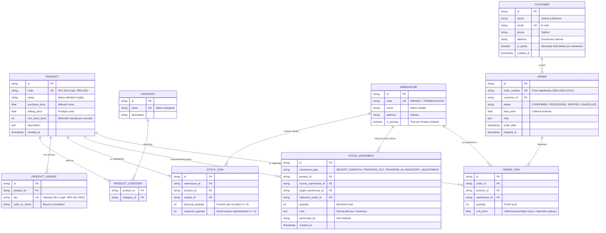

# Dřevěnka s.r.o. – Skladový a expediční systém pro e-shop

> **Technická dokumentace a zadání projektu (Single Source of Truth - SSOT)**  
> **Předmět:** Pokročilé programování (PPRO), ZS 2026/2027, FIM UHK  
> **Vyučující / Konzultace:** Dominik Palla (`dominik.palla@uhk.cz`)  
> **Zvolené téma:** **Zadání B: Sklad pro malý e-shop (Dřevěnka s.r.o.)**  
> **Klient:** Petr Doležal, Dřevěnka s.r.o.  
> **Status:** Kompletní specifikace, řešení otevřených bodů (ADR), 3-vrstvá architektura, ERD model, implementace s 400 položkami a testy.

---

## 1. O projektu a kontext klienta

### 1.1 Klient a podnikání
- **Klient:** Petr Doležal, majitel společnosti **Dřevěnka s.r.o.**
- **Předmět podnikání:** Výroba a prodej tradičních českých dřevěných hraček (káči, tahací kačenky, vláčky, stavebnice, domečky, hlavolamy).
- **Historie a kontext:** Podniká 10 let, poslední 3 roky tržby dynamicky rostou a sortiment dosáhl 400 aktivních položek.

### 1.2 Současný stav („Jak to mají dnes“)
- Veškeré zásoby jsou evidovány v **jednom sdíleném souboru v Excelu** se čtyřmi sty položkami, který mají v kanceláři a skladu otevřený na třech počítačích naráz.
- Zásoby se vedou ve dvou oddělených skladech:
  1. **Hlavní sklad v Hradci Králové** (u expediční kanceláře).
  2. **Sezónní garáž v Třebechovicích pod Orebem** (kam se odváží sezónní sortiment a přebytky z výroby).
- Objednávky z e-shopu chodí e-mailem a pracovníci je přepisují do Excelu ručně.
- **Kritická bolest klienta:** Dvakrát měsíčně se stane, že e-shop prodá zboží, které již fyzicky není na skladě.  
  *„Zákazníkovi pak volám a omlouvám se, a to je ta nejhorší část mojí práce.“*

---

## 2. Kompletní specifikace požadavků klienta

### 2.1 Co klient chce (Funkční požadavky)
1. **Produkty a kategorie:**
   - Produkt má název, kód (SKU), popis, nákupní a prodejní cenu.
   - Kategorií je více a produkt patří do několika naráz (vazba M:N): tatáž káča je současně „pro batolata“ i „dárky do 500 Kč“.
2. **Zásoby po skladech:**
   - U každého produktu musí být vidět, kolik kusů leží v Hradci a kolik v garáži v Třebechovicích.
3. **Objednávky zákazníků:**
   - Objednávka má zákazníka, datum, stav a několik položek. U položky je množství a zafixovaná cena, za kterou se prodalo.
4. **Odmítnutí objednávky, na kterou nejsou zásoby:**
   - Klíčový požadavek celého projektu: eliminovat prodej vyprodaného zboží a omluvné telefonáty.
5. **Dohledání pohybu:**
   - Ke každému výdeji vidět, ze kterého skladu se vydalo. Klient chce umět odpovědět na otázku *„kde je ta káča, co jsem ji měl minulý týden“*.
6. **Přesun mezi sklady:**
   - Řízená evidence převozu zboží ze zimní garáže do Hradce (dnes se neeviduje vůbec).
7. **Minimální zásoba a co doobjednat:**
   - Seznam položek pod minimem přímo na úvodní stránce s nákupním doporučením.
8. **Obrat po kategoriích za měsíc:**
   - Manažerský přehled tržeb po kategoriích hraček (*„Klient chce vědět, co ho živí“*).

### 2.2 Na čem klient trvá (Nekompromisní obchodní pravidla)
> Tato pravidla musí striktně vynucovat doménová a databázová vrstva:
1. **Vydat víc, než je na skladě, nesmí jít:** Žádná výdejka ani objednávka nesmí způsobit záporný fyzický stav.
2. **Cena v odeslané objednávce se nesmí zpětně změnit:** Při budoucí úpravě ceníku v katalogu musí historické objednávky zachovat původní prodejní cenu.
3. **Každá změna stavu zásob musí být dohledatelná:** *„Chci vidět, proč jich je sedmnáct a ne dvacet.“* Zákaz tichých úprav bez auditního záznamu.
4. **Zákazník se nemaže:** Zákazníci se k objednávkám vracejí s reklamacemi; fyzické mazání je zakázáno (používá se soft-delete).

### 2.3 Co klient prohodil mimochodem (Ergonomie a přání)
- *„Poštovné řešit nemusíme, to počítá e-shop.“*
- *„Ať to jde používat i z mobilu, já jsem půlku dne ve skladu.“* (responzivní rozhraní, velká dotyková tlačítka).
- *„Faktury zatím ne, ale jednou určitě.“* (architektura připravená na budoucí fakturační modul).
- *„Nejradši bych to měl barevně, ať vidím, co hoří.“* (barevný semafor červená/žlutá/zelená na dashboardu).

---

## 3. Rozhodnutí k otevřeným bodům zadání (ADR)

*V souladu s pravidly předmětu PPRO obsahuje tento oddíl explicitní rozhodnutí k bodům, které klient nechal otevřené:*

### Bod 1: Objednávka ze dvou skladů naráz
- **Rozhodnutí:** Objednávka standardně expeduje z **centrálního skladu v Hradci Králové**. Položky v objednávce nesou referenci na sklad expedice. Pokud část položek leží pouze v garáži v Třebechovicích, systém uživateli nabídne dvě varianty:
  1. **Doporučená:** Vystavit interní meziskladový přesun (převodku) z garáže do Hradce a odeslat zákazníkovi v jedné zásilce (šetří náklady na poštovné).
  2. Rozdělit objednávku na dvě samostatné expediční zásilky.
- **Odůvodnění:** Petr Doležal se zmínil, že *„poštovné řeší e-shop, ale posílat to nadvakrát je drahé“*. Systém dává přednost konsolidaci v Hradci, ale nezablokuje expedici, pokud klient spěchá.

### Bod 2: Co znamená „dost zásob“ a kdy se odečítá
- **Rozhodnutí:** Systém zavádí **dvoustavovou evidenci zásob**:
  - `physical_quantity` (fyzický stav na polici regálu).
  - `reserved_quantity` (zásoba zablokovaná potvrzenými, dosud neodeslanými objednávkami).
  - `available_quantity = physical_quantity - reserved_quantity` (disponibilní zásoba volná k prodeji).
  - **Odečítání probíhá dvoufázově:** V okamžiku přijetí objednávky systém provede **atomickou rezervaci** (disponibilní zásoba klesne ihned, čímž je zamezeno prodeji dalšímu zákazníkovi). Fyzický odpis z police proběhne až při zabalení a označení objednávky jako `SHIPPED` (vystavení výdejky).
- **Odůvodnění:** Přesně toto řešení odstraňuje klientovu noční můru omluvných telefonátů a zároveň odpovídá fyzické realitě ve skladu.

### Bod 3: Záporný stav a nesrovnalosti v garáži
- **Rozhodnutí:** Záporný stav je v systému **striktně zakázán** na úrovni databázového omezení (`CHECK (physical_quantity >= 0)`). Stav v garáži, který dle klienta *„nikdy nesedí“*, se řeší samostatným modulem **Inventurní vyrovnání (INVENTORY_ADJUSTMENT)**. Uživatel zadá skutečně napočítaný fyzický stav, systém automaticky vyčíslí rozdíl (manko / přebytek) a zapíše auditní pohyb s povinným odůvodněním a jménem pracovníka.
- **Odůvodnění:** Zboží do mínusu fyzicky neexistuje; povolit záporný stav by zničilo integritu skladu a zkreslilo finanční reporting. Inventurní protokol naopak přináší pořádek a jasnou zodpovědnost.

### Bod 4: Varianty produktu (Káča ve třech barvách)
- **Rozhodnutí:** Systém zavádí hierarchický model: mateřský produkt `Product` (sdružuje obecný název, popis, zařazení do kategorií a nákupní/prodejní cenu) a podřízenou entitu `ProductVariant` s unikátním SKU kódem (např. `HRA-001-RED`, `HRA-001-BLU`, `HRA-001-NAT`). Skladová zásoba `StockItem` je vedena samostatně pro každou variantu a sklad.
- **Odůvodnění:** E-shop prezentuje jednu kartu hračky, ale skladník ve skladu v Hradci i v garáži přesně ví, kolik červených káč má na polici a které barvy dochází.

### Bod 5: Změna objednávky po zaplacení
- **Rozhodnutí:** Objednávka implementuje stavový automat (`CONFIRMED`, `PROCESSING`, `SHIPPED`, `CANCELLED`). Telefonickou změnu položek po zaplacení systém umožňuje **pouze do okamžiku expedice** (`CONFIRMED` / `PROCESSING`). Při změně položek systém automaticky upraví rezervace a přepočte celkovou cenu s vyčíslením přeplatku/nedoplatku. Jakmile je objednávka označena jako `SHIPPED`, je neměnná a jakákoliv změna se řeší standardním reklamačním protokolem / vratkou.
- **Odůvodnění:** Respektuje reálnou praxi, kdy zákazník zavolá před odesláním balíčku, aniž by došlo k porušení integrity účetnictví či skladu.

---

## 4. Architektura systému a plnění povinného minima

Projekt beze zbytku naplňuje všechna kritéria společného minima pro předmět PPRO:

| Požadavek minima | Způsob realizace v projektu Dřevěnka s.r.o. |
| :--- | :--- |
| **Technologický stack (Python)** | **Backend:** Python 3.11+, FastAPI (asynchronní i synchronní REST API, automatická OpenAPI dokumentace).<br>**Prezentační vrstva:** Jinja2 serverové šablony + Vanilla CSS (optimalizováno pro dotykové mobily skladníků).<br>**ORM & Datová vrstva:** SQLAlchemy 2.0 (deklarativní mapování), Pydantic v2 (DTO & validace).<br>**Relační DB:** PostgreSQL (v produkci/Dockeru) / SQLite (lokální rychlé testy).<br>**Testy:** pytest (unit & integrační testy). |
| **3 vrstvy se závislostmi jedním směrem** | 1. **Prezentační vrstva (`src/presentation/`):** FastAPI webové routy, Jinja2 šablony, CSS assety, REST API.<br>2. **Aplikační/Doménová vrstva (`src/domain/`, `src/application/`):** Doménové modely, `InventoryService`, `OrderService`, `ReportingService`.<br>3. **Datová/Infrastrukturní vrstva (`src/infrastructure/`):** SQLAlchemy ORM modely, DB engine, seed skript pro 400 hraček. |
| **Relační databáze v Dockeru** | PostgreSQL běžící v kontejneru v rámci Docker Compose sítě (`drevenka_postgres`). |
| **Databázová integrita** | Integritní omezení `CHECK (physical_quantity >= 0)`, cizí klíče a unikátní indexy pro SKU. |
| **Nejméně 5 entit** | 1. `Product` (Dřevěná hračka)<br>2. `Category` (Kategorie zboží)<br>3. `ProductVariant` (Barevné varianty káči apod.)<br>4. `Warehouse` (Sklad Hradec a Garáž Třebechovice)<br>5. `StockItem` (Stav zásob na konkrétním skladě)<br>6. `StockMovement` (Auditní log pohybů)<br>7. `Customer` (Zákazník e-shopu)<br>8. `Order` (Objednávka)<br>9. `OrderItem` (Položka objednávky se snapshotem ceny) |
| **Alespoň jedna vazba M:N** | Vazba mezi hračkou (`Product`) a kategorií (`Category`) realizovaná vazební tabulkou `product_categories` (tatáž káča je současně „pro batolata“ i „dárky do 500 Kč“). |
| **Automatizované testy** | Sada pytest testů (`tests/test_drevenka.py`) ověřující odmítnutí objednávky při nedostatku zásob, zákaz záporného stavu, fixaci cen v objednávce, meziskladové přesuny a obrat po kategoriích. |
| **Spuštění jedním příkazem** | Kompletní aplikace a databáze startují přes `docker compose up --build`. |
| **Syntetická data (400 položek)** | Seed skript `src/infrastructure/seed.py` generuje všech 400 dřevěných hraček ze zadání klienta s rozpadem zásob mezi Hradcem a Třebechovicemi a položkami pod minimem. |

---

## 5. Doménový model a ER diagram (Mermaid)



---

## 6. Klíčové byznys algoritmy

### 6.1 Atomická kontrola a odmítnutí objednávky (Požadavek 4)
- **Vstup:** Položky objednávky $[(P_i, Q_i, W_i)]$.
- **Postup:**
  1. Pro každou položku se zamkne řádek v tabulce `stock_items` pomocí pesimistického zámku (`with_for_update()`).
  2. Spočte se volná disponibilní zásoba:
     $$\text{available} = \text{physical\_quantity} - \text{reserved\_quantity}$$
  3. Pokud pro kteroukoliv položku platí $\text{available} < Q_i$, objednávka je **okamžitě odmítnuta**, celá transakce je vrácena zpět (`ROLLBACK`) a e-shop obdrží chybovou hlášku s detailním výpisem chybějících kusů.
  4. Pokud je vše skladem, navýší se `reserved_quantity += Q_i`, zafixuje se aktuální prodejní cena do `unit_price` a objednávka přejde do stavu `CONFIRMED`.

### 6.2 Meziskladový převod Garáž $\rightarrow$ Hradec (Požadavek 6)
- **Vstup:** `product_id`, `from_warehouse_id` (Garáž), `to_warehouse_id` (Hradec), `quantity`.
- **Integritní pravidlo:** Vydat víc, než je volně na skladě, nesmí jít:
  $$\text{available}_{\text{source}} \ge \text{quantity}$$
- **Provedení:**
  1. Zdrojový sklad: $\text{physical}_{\text{source}} \leftarrow \text{physical}_{\text{source}} - \text{quantity}$.
  2. Cílový sklad: $\text{physical}_{\text{target}} \leftarrow \text{physical}_{\text{target}} + \text{quantity}$.
  3. Do `stock_movements` se zapíší dva auditní záznamy: `TRANSFER_OUT` a `TRANSFER_IN`.

### 6.3 Inventurní protokol pro garáž bez záporného stavu (Bod 3)
- Uživatel zadá skutečný napočítaný stav $Q_{\text{actual}} \ge 0$.
- Spočte se rozdíl $\Delta = Q_{\text{actual}} - \text{physical}_{\text{old}}$.
- Nastaví se nový fyzický stav $\text{physical} \leftarrow Q_{\text{actual}}$.
- Zaznamená se auditní pohyb typu `INVENTORY_ADJUSTMENT` s vyčíslením manka ($\Delta < 0$) nebo přebytku ($\Delta > 0$).

### 6.4 Semafor minimálních zásob na dashboardu („Co hoří“)
- Pro každý produkt se spočte celková zásoba přes oba sklady.
- Vyhodnocení stavu:
  - **ČERVENÁ (Hoří!):** $\text{total\_physical} < \text{min\_stock\_level}$.
  - **ŽLUTÁ (Pozor):** $\text{min\_stock\_level} \le \text{total\_physical} \le 1.2 \times \text{min\_stock\_level}$.
  - **ZELENÁ (V pořádku):** $\text{total\_physical} > 1.2 \times \text{min\_stock\_level}$.
- Výpočet nákupního doporučení: $\text{reorder} = \max(\text{min\_stock\_level} \times 2, 10) - \text{total\_physical}$.

### 6.5 Měsíční obrat po kategoriích (Požadavek 8)
- Agregace realizovaných objednávek za vybraný měsíc a rok:
  $$\text{Tržba}_{\text{kategorie}} = \sum_{P \in \text{kategorie}} \sum_{I \in \text{OrderItems}(P)} (I.\text{quantity} \times I.\text{unit\_price})$$
- Vzhledem k vazbě M:N se prodeje káči promítnou do obratu kategorie „Pro batolata“ i „Dárky do 500 Kč“.

---

## 7. Spuštění a provoz

### Prerekvizity
- Docker Desktop / Docker Engine s podporou Docker Compose

### Spuštění celého systému v Dockeru
```bash
docker compose up -d --build
```
Po nastartování:
- **Hlavní dashboard („Co hoří“):** `http://localhost:8000/`
- **Katalog 400 hraček se sklady:** `http://localhost:8000/products`
- **Objednávky a rezervace:** `http://localhost:8000/orders`
- **Meziskladový převod:** `http://localhost:8000/transfer`
- **Pohyby na skladě (Audit log):** `http://localhost:8000/movements`
- **Měsíční obrat po kategoriích:** `http://localhost:8000/reports`
- **Interaktivní OpenAPI dokumentace (Swagger):** `http://localhost:8000/docs`
- **Databáze PostgreSQL:** `localhost:5432`

### Lokální spuštění bez Dockeru (Development)
```bash
# Vytvoření a aktivace venv
python -m venv venv
.\venv\Scripts\activate   # Windows PowerShell
# source venv/bin/activate # Linux/macOS

# Instalace závislostí
pip install -r requirements.txt

# Inicializace 400 produktů a spuštění serveru
python -m src.infrastructure.seed
uvicorn src.presentation.app:app --reload --port 8000
```

### Spuštění automatizovaných testů
```bash
pytest -v
```

---

## 8. Deník změn a postup prací (Changelog)

- **2026-10-07 (Přechod na Zadání B: Sklad pro malý e-shop Dřevěnka s.r.o.):**
  - Aktualizována autoritativní dokumentace `README.md` i provozní směrnice `AGENTS.md` na Zadání B (Petr Doležal, Dřevěnka s.r.o.).
  - Vyřešeno všech 5 otevřených bodů klienta v sekci ADR (ADR 1–5): dvoustavová evidence zásob, okamžité odmítnutí při nedostatku, zákaz záporného stavu s modulem inventury, varianty káči v různých barvách, změna objednávky do expedice.
  - Kompletně vyplněn a aktualizován oficiální Word dokument `PPRO_Dokumentace.docx` (hlavička, popis řešení, 10 architektonických rozhodnutí, tabulka změn klienta).
  - Vytvořen hrubý koncepční návrh pro klienta Petra Doležala (`hruby_nastrel_klient.md`).
  - Implementována 3-vrstvá architektura: doménové modely (`Product`, `Category`, `ProductVariant`, `Warehouse`, `StockItem`, `StockMovement`, `Customer`, `Order`, `OrderItem`), aplikační služby (`InventoryService`, `OrderService`, `ReportingService`) a prezentační vrstva ve FastAPI s Jinja2 šablonami a responzivním CSS.
  - Implementován barevný dashboard („co hoří“) se semaforem minimálních zásob.
  - Vytvořen seed skript se 400 realistickými dřevěnými hračkami a rozpadem zásob mezi Hradcem Králové a garáží v Třebechovicích.
  - Vytvořena sada automatizovaných testů v `tests/test_drevenka.py` pokrývající všechna obchodní pravidla.
  - Připravena Docker konfigurace (`drevenka_postgres`, `drevenka_web`).
